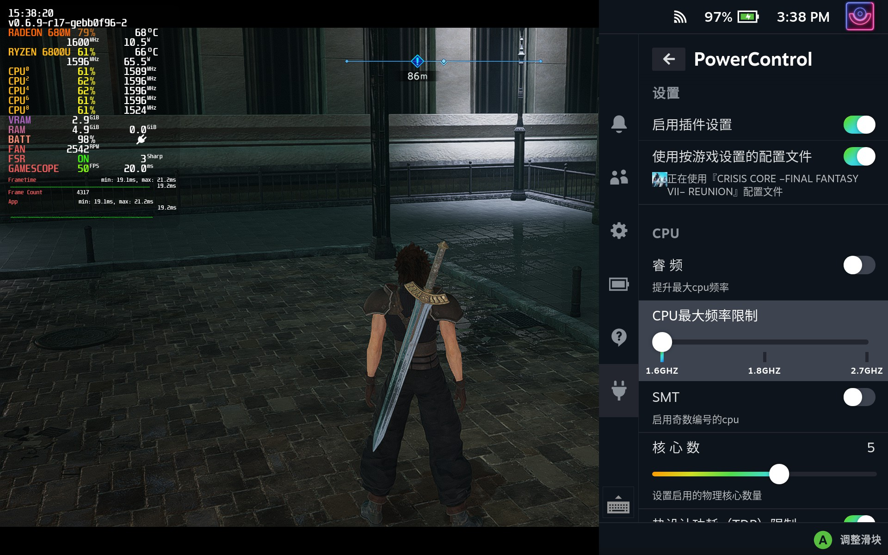
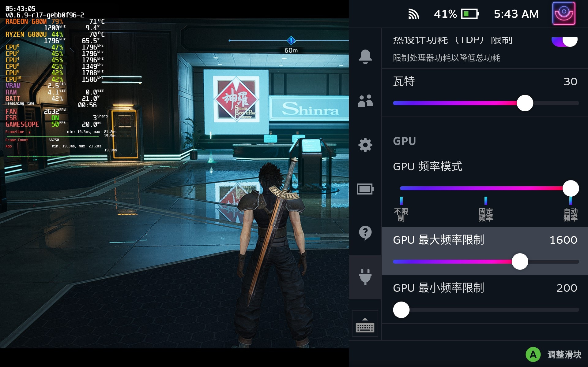
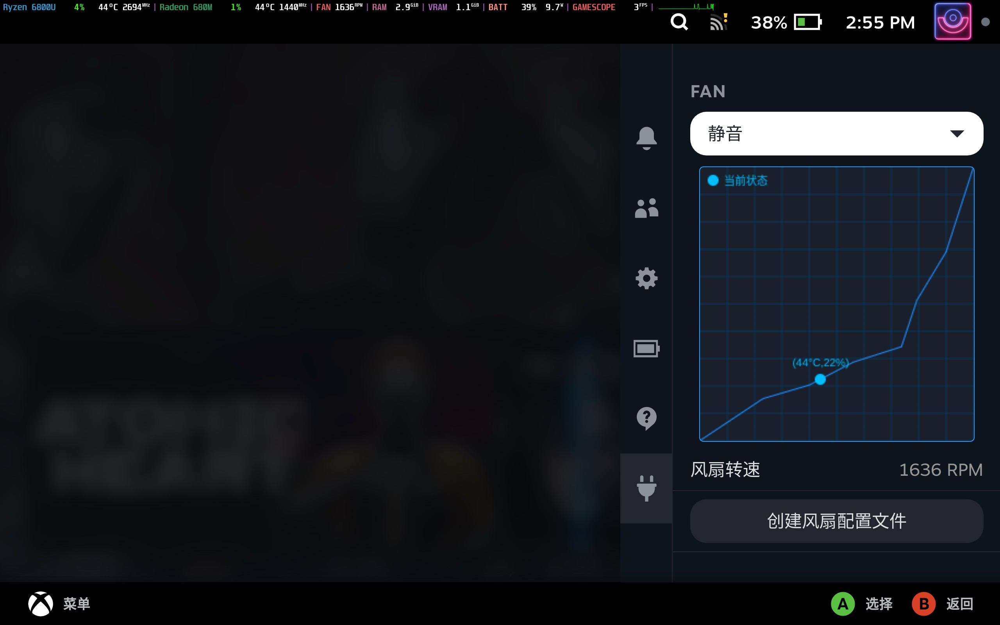

# PowerControl
用于[decky-loader](https://github.com/SteamDeckHomebrew/decky-loader)的插件  
为安装了[holoiso](https://github.com/theVakhovskeIsTaken/holoiso)的手持设备提供性能设置调整  

## 安装

1. 安装[decky-loader](https://github.com/SteamDeckHomebrew/decky-loader)
2. 下载[Releases](https://github.com/Gawah/PowerControl/releases)页面的PowerControl.tar.gz
3. 解压到/home/xxxx/homebrew/plugins/下
4. 进入游戏模式，即可在decky页面使用该插件

## 功能
1. 开关睿频
2. 开关超线程
3. 调整物理核心开启数量
4. 限制TDP
5. 固定GPU频率
6. 自动GPU频率

**- 自动GPU频率根据GPU使用率自动调整频率，推荐配合关闭睿频以及高TDP设置使用，或限制最大最小GPU频率来使用，以实现TDP浮动达到省电的目的**  

## 已知问题
- 6800U在休眠后GPU监控文件会冻结，导致无法正常使用自动GPU频率功能,默认由系统在最小最大频率限制之间调度。该问题是由内核问题导致的，使用6.1以上的内核即可  

## 演示

## 性能调整范围预设
> 以下为各个芯片对应的预设TDP

|      芯片        | TDP |
| --------------- | ---- | 
| AMD 5560U       | 18 W |
| AMD 5800U 5825U | 30 W |
| AMD 6800U       | 40 W |
| AMD 4800U 4500U | 25 W |
| AMD 4500U       | 25 W |
| 其他             | 18 W |

**TDP调整基于ryzenadj,因此只支持ryzenadj支持的cpu列表.如有未列出的cpu或者给出的范围数值不正确,请在[issuse](https://github.com/Gawah/PowerControl/issues)提交**

## 支持
   可以加入我们的qq群:487945399反馈问题，或者在[issuse](https://github.com/Gawah/PowerControl/issues)提交

## Reference
[decky-loader](https://github.com/SteamDeckHomebrew/decky-loader)  
[vibrantDeck](https://github.com/libvibrant/vibrantDeck)  
[decky-plugin-template](https://github.com/SteamDeckHomebrew/decky-plugin-template)  
[RyzenAdj](https://github.com/FlyGoat/RyzenAdj)  
