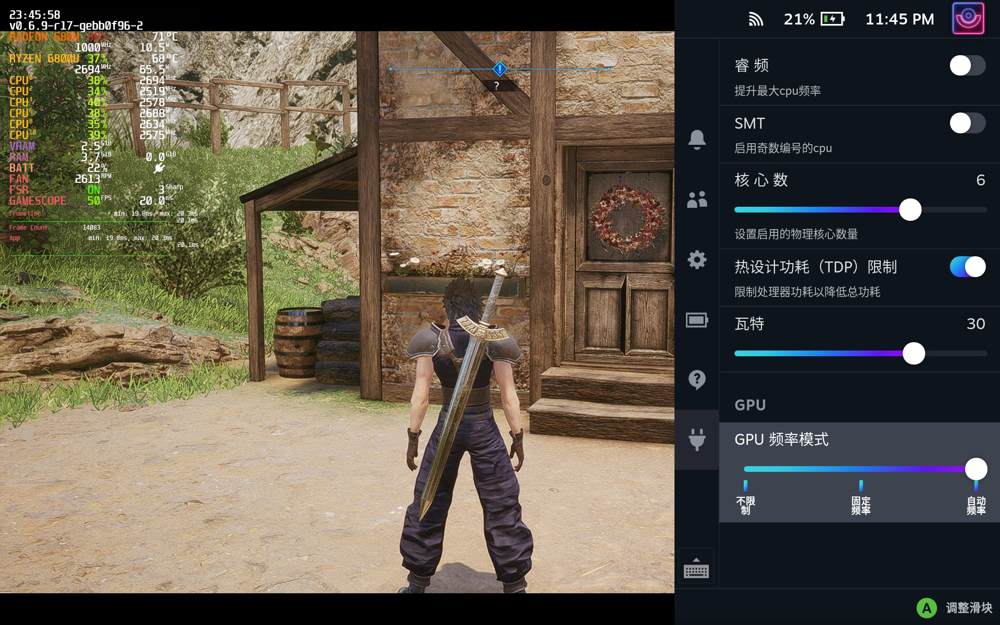

# PowerControl
用于[decky-loader](https://github.com/SteamDeckHomebrew/decky-loader)的插件  
为安装了[holoiso](https://github.com/theVakhovskeIsTaken/holoiso)的手持设备提供性能设置调整  

## 安装

1. 安装[decky-loader](https://github.com/SteamDeckHomebrew/decky-loader)
2. 下载[Releases](https://github.com/Gawah/PowerControl/releases)页面的PowerControl.tar.gz
3. 解压到/home/xxxx/homebrew/plugins/下
4. 进入游戏模式，即可在decky页面使用该插件

## 功能
1. 开关睿频
2. 开关超线程
3. 调整物理核心开启数量
4. 限制TDP
5. 固定GPU频率
6. 自动GPU频率
7. 限制cpu最大频率

**自动GPU频率根据GPU使用率自动调整频率，最好配合关闭睿频使用，目前检测较为简单，可能存在一定问题**  
**cpu最大频率限制参考[CPU frequency scaling](https://wiki.archlinux.org/title/CPU_frequency_scaling#Setting_maximum_and_minimum_frequencies) 只能限制在内核提供的cpu频率数据**  

## 演示

## 性能调整范围预设

### AMD 5560U
TDP最大：18 W  GPU频率：200-1600 Mhz

### AMD 5800U 5825U
TDP最大：30 W  GPU频率：200-2000 Mhz

### AMD 6800U
TDP最大：40 W  GPU频率：200-2200 Mhz

### 其他
TDP最大：15 W  GPU频率：200-1600 Mhz

**TDP调整基于ryzenadj,因此只支持ryzenadj支持的cpu列表.如有未列出的cpu或者给出的范围数值不正确,请在[issuse](https://github.com/Gawah/PowerControl/issues)提交**

## 支持
   可以加入我们的qq群:487945399反馈问题，或者在[issuse](https://github.com/Gawah/PowerControl/issues)提交

## Reference
[decky-loader](https://github.com/SteamDeckHomebrew/decky-loader)  
[vibrantDeck](https://github.com/libvibrant/vibrantDeck)  
[decky-plugin-template](https://github.com/SteamDeckHomebrew/decky-plugin-template)  
[RyzenAdj](https://github.com/FlyGoat/RyzenAdj)  
